# Project-cloud

Group: Maya Gawinowski & Nicolas Chalant

---

Table of Contents

1.  [App deployment](#deployment)
2.  [Quizz](#quizz)
3.  [IAM policies](#iam)
4.  [Quicksight dashboard](#dashboard)

---

  
## App deployment

The purpose of this project is to deploy an application on AWS to make sure that Social Research Organization has a secure and robust website. You can find more information on our objectives on the subject : https://github.com/pascalito007/efrei-cloud-bigdata/tree/master/capstone-project  

The first step was to define our infrastructure. We chose to work on the following one: 

Our PHP application will be in the EC2 Instance in the public subnet. With the VPC and its internet gateway. The users, here represented by the PC, will be able to access our application.

To keep our data safe, we can use Amazon RDS with MariaDB, with the Systems Manager Parameter Store, all the connection information will be stored and accessible by the application.

Please note that we created our own network stack while doing this project. 
  
Let’s apply the previous schema by creating a new VPC.
  
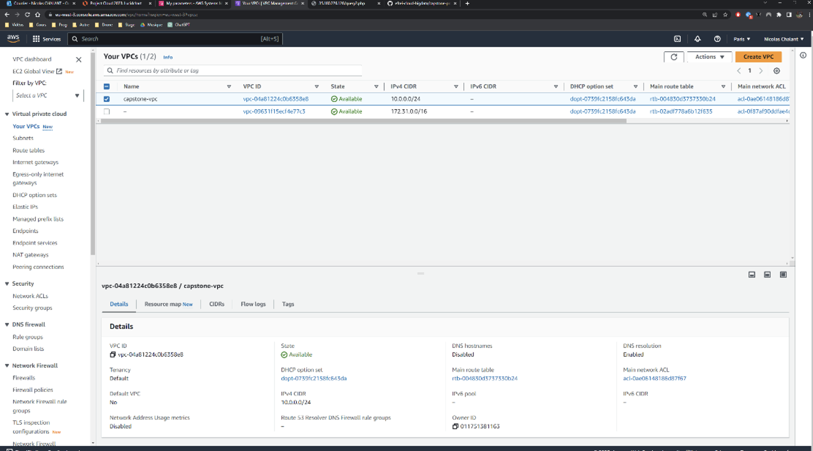
  
Then we will create a new public subnet
  

  
We then created a new Internet Gateway
  

  
Next, we added a route to our VPC route table. This route is to connect our VPC to our internet gateway.
  

  
The next step is to create a new EC2 instance based on the following AMI: Cloud9AmazonLinux2-2023-06-22T17-21. This instance is linked to our public subnet.
  

  
We can see that our website is running (after we added a new inbound rule for http and did all the installations required). We connected a terminal using SSH connection. 
  
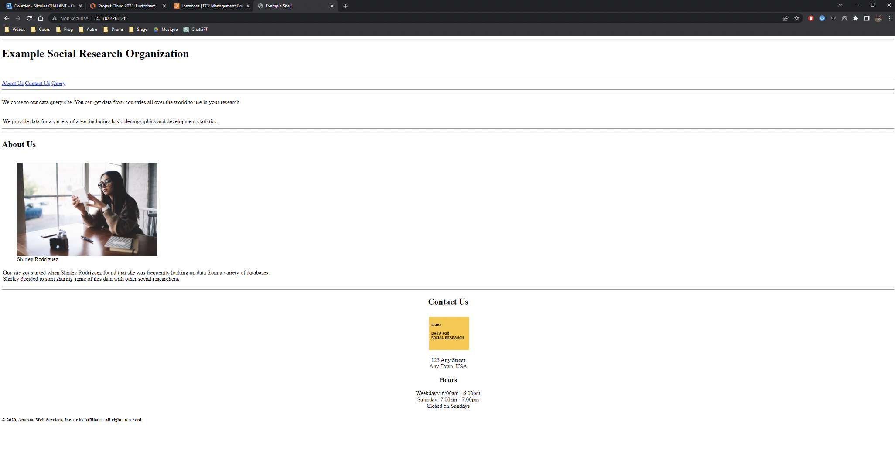
  

  

  
Now that we have our first subnet ready to run our instance, we had to create another one for our database. We specifically chose to create the two subnets in two different regions (to create the RDS database properly)
  

  
We then created a MariaDB database container on RDS. We created a new security group.
  

  
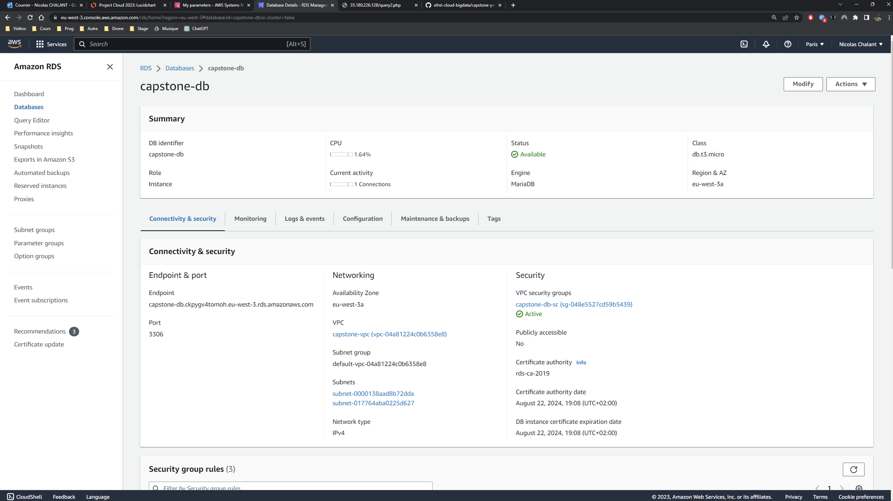
  
The next step was to connect to this database. To do so, we checked the databases, we saw that we had to create a new one. So, we created capstonedb.
  
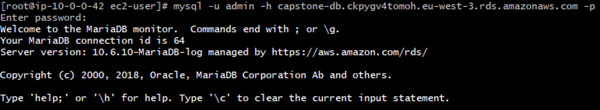
  

  
We then proceed to use this DB and to run the script.
  

  
Once it was done, we knew that we needed to allow the app to access the connection information. We did that part using the AWS Systems Manager. We created the 4 important endpoints for the app.
  
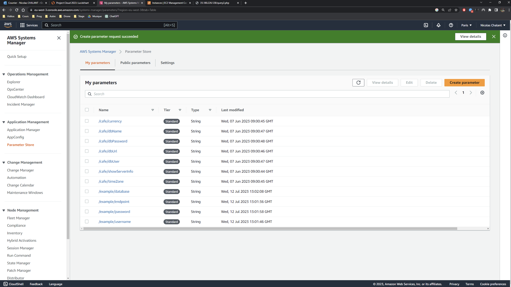
  
And it worked! We can see that the queries are working on our application.
  

  

  
## Quizz

Network:

1: Answer 3  
2: Answer 3  
3: Answers 1, 3 and 6 
4: Answer 4 

IAM: 

1: Answer 3  
2: Answer 1 
3: Answers 3 and 4 
4: Answer 1 
5: Answer 2 
6: Answer 3 
7: Answer 1 

  
## IAM policies

Question1: what actions are allowed for EC2 instances and S3 objects based on this policy? What specific resources are included?
  

  
EC2 instances
* “ec2:RunInstances”: allows the user to launch new EC2 instances.
* “ec2:TerminateInstances”: allows the user to terminate EC2 instances.
*“arn:aws:ec2:us-east-1:123456789012:instance/*: allows all actions on all EC2 instances in the specified region (us-east-1) for the account ID 123456789012.

S3 instances
*“s3:GetObject”: allows the user to retrieve S3 objects
*“s3:PutObject”: allows the user to upload S3 objects
*“arn:aws:s3:::example-bucket/*”: allows actions on all objects within the example-bucket S3 bucket. 

Question2: under what condition does this policy allows access to VPC-related information? Which AWS region?
  

  
*“aws:RequestRegion”: “us-west-2” : allows access to VPC-related information only if the requested AWS region is set to “us-west-2”.

Question3: what actions are allowed on the “example-bucket” and its objects based on this policy? What specific prefixes are specified in the condition?
  

  
Actions allowed on “example-bucket”: 
*“s3:GetObject”: allows the user to retrieve objects from the “example-bucket”. 
*“s3:PutObject”: allows the user to upload objects into the “example-bucket”. 
*“s3:ListBucket”: allows the user to list objects within the “example-bucket”. 

Specified prefixes in the condition: 
*“documents/*”: allows access to objects in the “bucket-example” that have the “document” prefix. 
*“images/*”: allows access to objects in the bucket-example” that have the “images” prefix. 

Question4: what actions are allowed for IAM users based on this policy? How are the resources ARNs constructed?
  

  
Allowed actions: 
*“iam:CreateUser”: allows the user to create IAM users. 
*“iam:DeleteUser”: allows the user to delete IAM users. 

Resource ARNs: 
*Follows the following template “arn:aws:iam::123456789012:user/${aws:username}” 
*“${aws:username} is dynamically replaced by the username of the user currently connected. Ensures the users will only perform their allowed actions on their own IAM user resource. 

Question5:  
*Which AWS service does this policy grant you access to? 
*Does it allow you to create an IAM user, group, policy, or role? 
*Go to https://docs.aws.amazon.com/IAM/latest/UserGuide/ and in the left navigation expand Reference > Policy Reference > Actions, Resources, and Condition Keys. Choose Identity And Access Management. Scroll to the Actions Defined by Identity And Access Management list.��Name at least three specific actions that the iam:Get* action allows.
  

  
*This policy grant access to all actions that start with Get “iam:Get*” and all actions that start with List “iam:List*”. 
*It does not allow to create anything. For that we would need to add “iam:Create*” to the actions allowed. 
“iam:Get*” allows 
*“Iam:GetGroup”: allows to retrieve a list of IAM users that are in the specified IAM group. 
*“iam:GetRole”: allows to retrieve information about the specified role (role’s path, GUID, ARN, role’s trust policy). 
*“iam:GetUser”: allows to retrieve information about the specified IAM user (user’s creation date, path, unique ID and ARN).  

Question6: 
  

  
*What actions does the policy allow? 

The actions “ec2:RunInstances” and “ec2:StartInstances” are denied to the user this policy is assigned to. However all actions not lister in the actions will be allowed to the user.  

*Say that the policy included an additional statement object, like this example:
  

  
*How would the policy restrict the access granted to you by this additional statement? 
*If the policy included both the statement on the left and the statement in question 2, could you terminate an m3.xlarge instance that existed in the account? 

The “allow” statement takes precedence over the “deny” effect. Therefore, the user will have access to all actions on ec2 instances and the actions defined before will not be taken into account. 
You would be able to terminate an instance as you would have all actions allowed on ec2 instances. 

  
## Quicksight dashboard

First, here is an overview of our final dashboard:
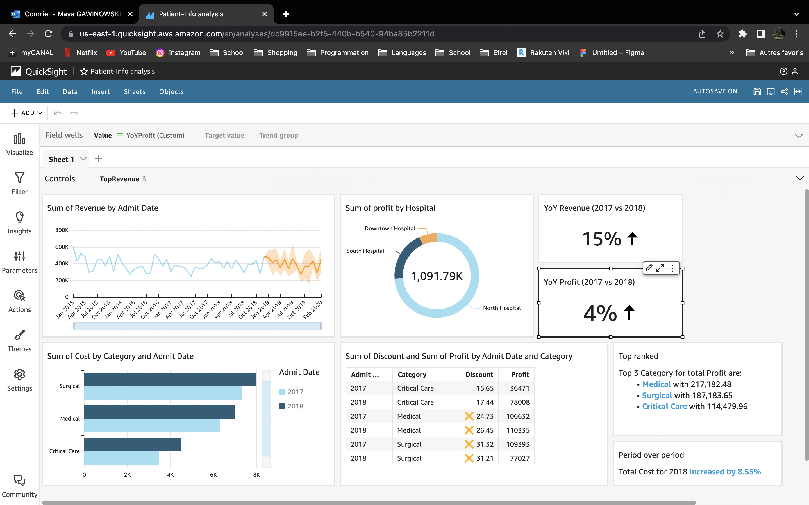
  
We are now going to go through each of these KPIs
  

### Sum of revenue by admition date
 
For this one, we chose a line chart visual with the revenue(sum) for the value field and the admition date(year) for the x-axis(month). As the dataset does not go past 2018, we did a forecast telling us the tendency over the year 2019.
  

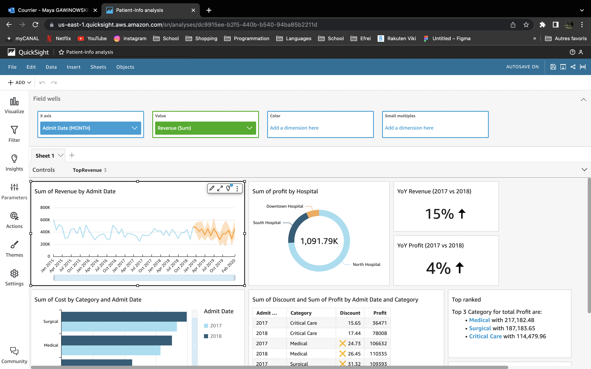
  

### Sum of profit by hospital
 
Here, we chose a donut chart visual with hospital for the group/color field and profit(sum) for the value field.
As we noticed that in most of the charts given in the subjects, it is centered around the three categories Critical care, medical and surgical. We chose to add a filter here to only have the profit for these three categories.
  

  

### YoY Revenue (2017 vs 2018)
 
For this one, we did a little bit more calculation. First we modified the actual dataset by adding two new calculation fields: one giving us the revenue for each of the three categories (critical care, medical, surgical) for the year 2017 (filtered-revenue-2017). And another one doing the same thing but for the year 2018 (filtered-revenue2018). Also prior to creating these two new fields, we extracted the admition year into a new field as well so we would not have to care about the rest of the date information.
Then, we added a KPI visual and as the value of it we created a new calculation field calculating the increase in revenue between the years 2017 and 2018 (YoYRevenue). 
  

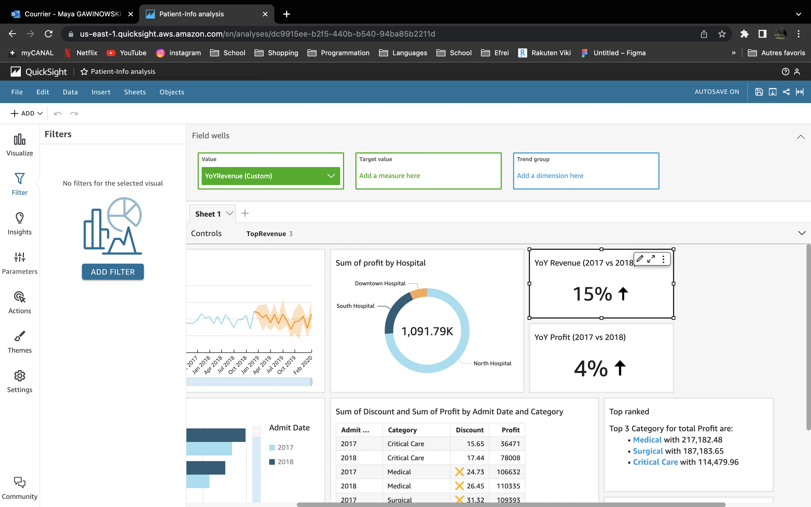

  

### YoY Profit (2017 vs 2018)
 
For this one, we did a little bit more calculation. First we modified the actual dataset by adding two new calculation fields: one giving us the profit for each of the three categories (critical care, medical, surgical) for the year 2017 (filtered-profit-2017). And another one doing the same thing but for the year 2018 (filtered-profit-2018). Also prior to creating these two new fields, we extracted the admition year into a new field as well so we would not have to care about the rest of the date information.
Then, we added a KPI visual and as the value of it we created a new calculation field calculating the increase in profit between the years 2017 and 2018 (YoYProfit). 
  

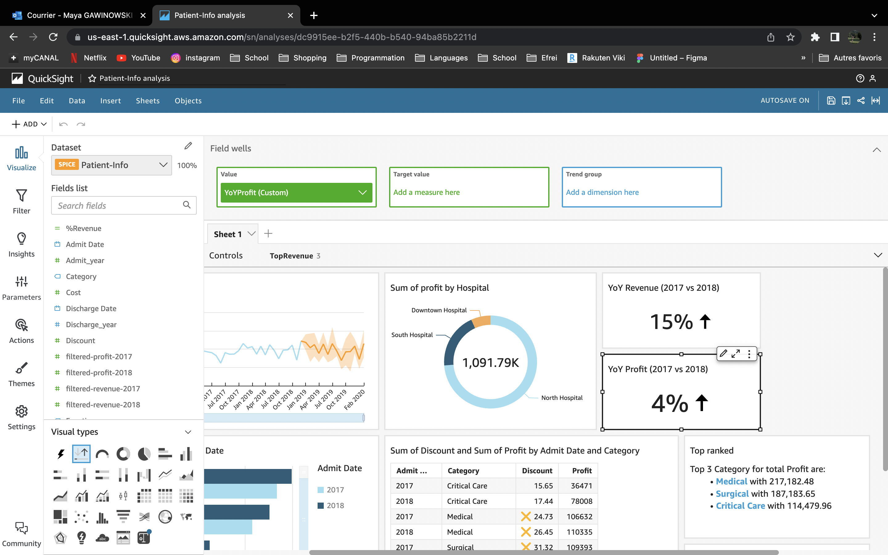

---

---

---

  

### Sum of cost by category and admition year 
 
Here, we created an horizontal bar chart visual with the category on the y-axis field, the cost(sum) in the value field and the admition date(year) in the group/color field. To then make sure we only have the three categories as shown in the subject, we added a filter restricting the amount of categories we wish to display. We also added a filter to only showcase the data for the years 2017 and 2018.
  

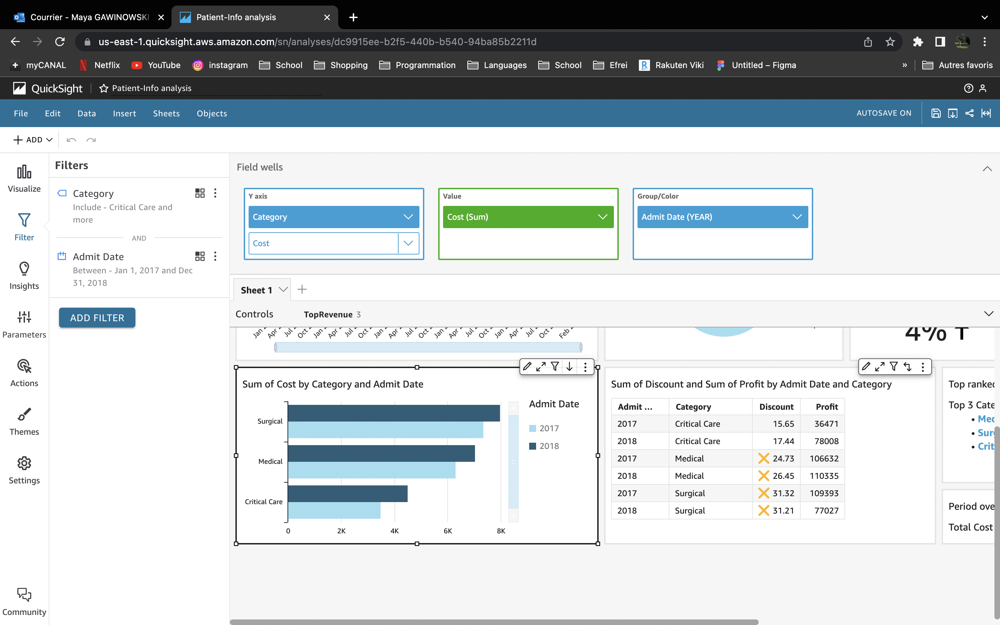
  

### Sum of discount and sum profit by admition date and category  
 
For this one, we chose a table visual with discount(sum) and profit(sum) in the value field and the admition date(year) and category in the group by field. We then added two filters: one for filtering the years (only 2017 and 2018) and one for filtering the categories (only critical care, surgical and medical).
We also added a conditional formating on the discount(sum) value so that when it get greater than 20, we display an orange cross next to the value.
  

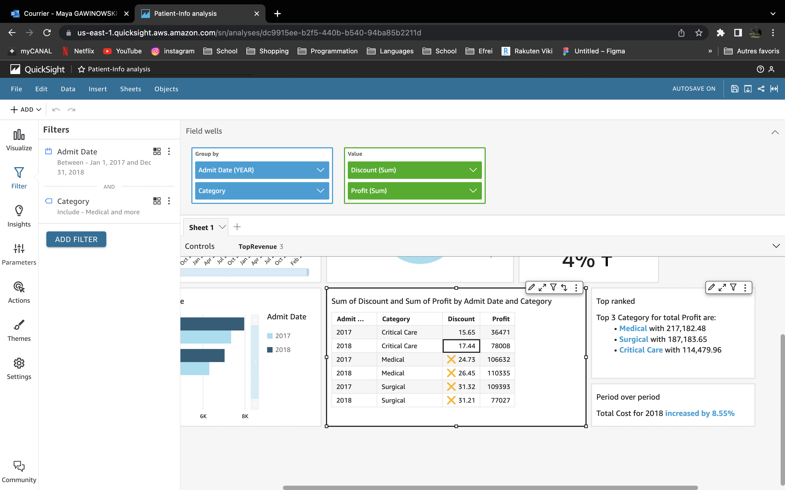

  

### Top 3 categories for total profit
 
Here, we added a new insight in top ranked with the profit(sum) in the values field and category in the categories field. We also added two filters to only showcase the three categories (critical care, surgical and medical) as well as making the profit sum only on the years 2017 and 2018.
  

  

### Total increase in cost in 2018
 
For this one, we created a new period over period insight with admition date(year) in the time field and the cost(sum) in the values field.
  

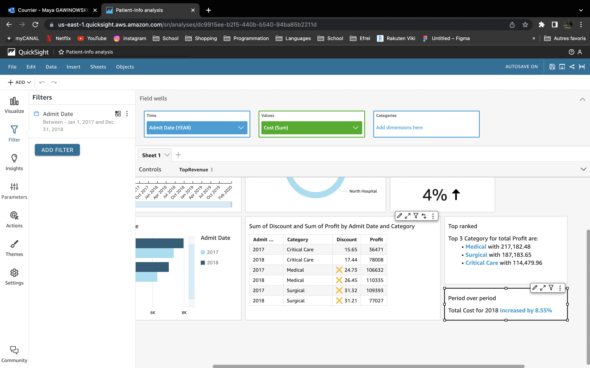
