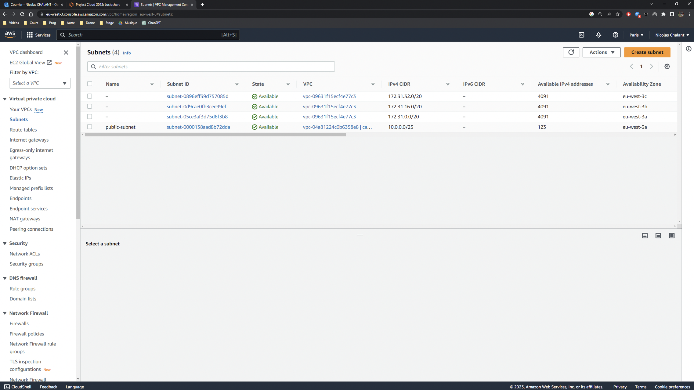
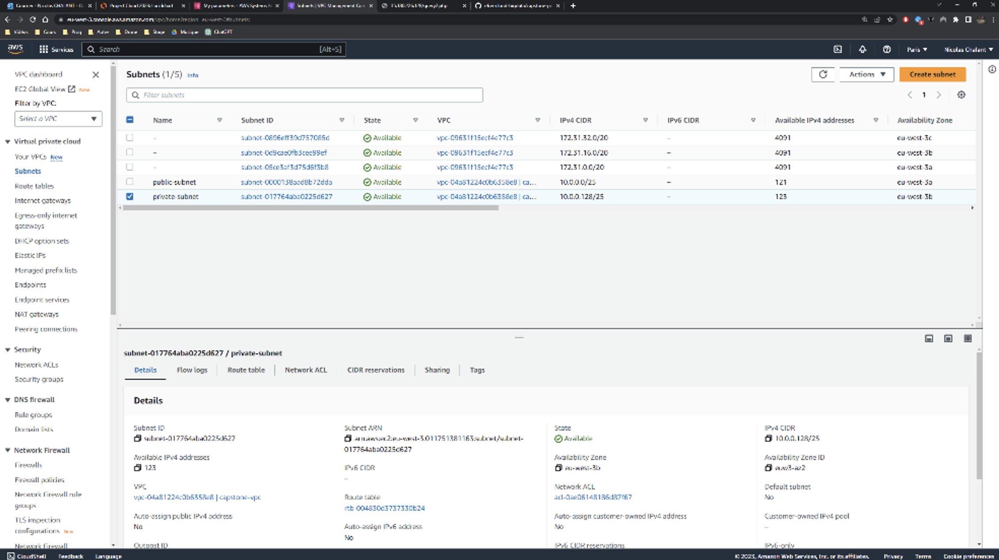
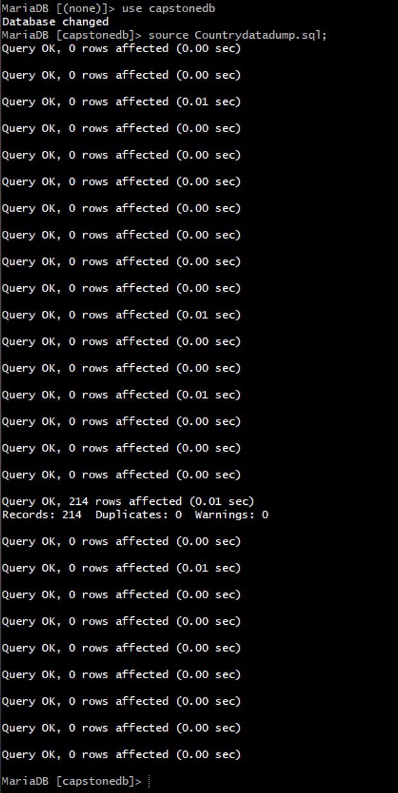
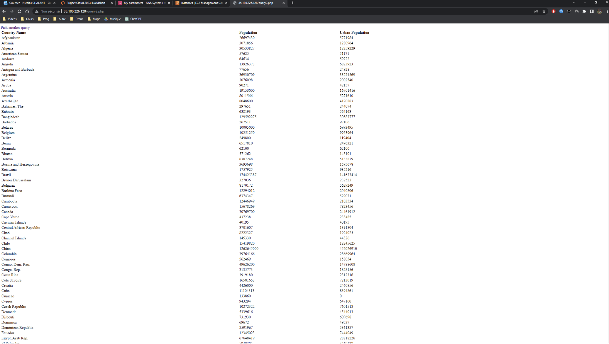
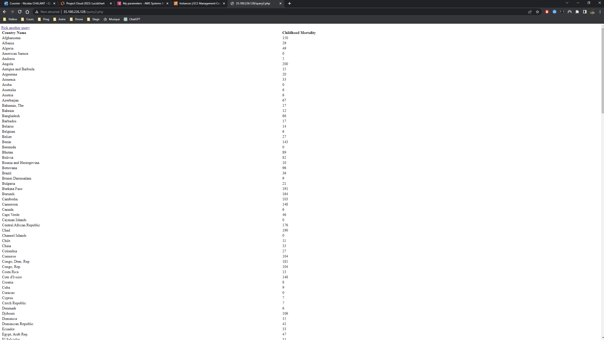

# Project-cloud

---

Table of Contents

1.  [App deployment](#deployment)
2.  [Quizz](#quizz)
3.  [IAM policies](#iam)
4.  [Quicksight dashboard](#dashboard)

---

  
## App deployment

The purpose of this project is to deploy an application on AWS to make sure that Social Research Organization has a secure and robust website. You can find more information on our objectives on the subject : https://github.com/pascalito007/efrei-cloud-bigdata/tree/master/capstone-project  

The first step was to define our infrastructure. We chose to work on the following one: 

Our PHP application will be in the EC2 Instance in the public subnet. With the VPC and its internet gateway. The users, here represented by the PC, will be able to access our application.

To keep our data safe, we can use Amazon RDS with MariaDB, with the Systems Manager Parameter Store, all the connection information will be stored and accessible by the application.

Please note that we created our own network stack while doing this project. 
  
Let’s apply the previous schema by creating a new VPC.
  

  
Then we will create a new public subnet
  

  
We then created a new Internet Gateway
  

  
Next, we added a route to our VPC route table. This route is to connect our VPC to our internet gateway.
  

  
The next step is to create a new EC2 instance based on the following AMI: Cloud9AmazonLinux2-2023-06-22T17-21. This instance is linked to our public subnet.
  

  
We can see that our website is running (after we added a new inbound rule for http and did all the installations required). We connected a terminal using SSH connection. 
  

  

  

  
Now that we have our first subnet ready to run our instance, we had to create another one for our database. We specifically chose to create the two subnets in two different regions (to create the RDS database properly)
  

  
We then created a MariaDB database container on RDS. We created a new security group.
  

  

  
The next step was to connect to this database. To do so, we checked the databases, we saw that we had to create a new one. So, we created capstonedb.
  

  

  
We then proceed to use this DB and to run the script.
  

  
Once it was done, we knew that we needed to allow the app to access the connection information. We did that part using the AWS Systems Manager. We created the 4 important endpoints for the app.
  

  
And it worked! We can see that the queries are working on our application.
  

  

  
## Quizz

Network:

1: Answer 3  
2: Answer 3  
3: Answers 1, 3 and 6 
4: Answer 4 

IAM: 

1: Answer 3  
2: Answer 1 
3: Answers 3 and 4 
4: Answer 1 
5: Answer 1 
6: Answer 3 
7: Answer 1 

  
## IAM policies

  
## Quicksight dashboard
